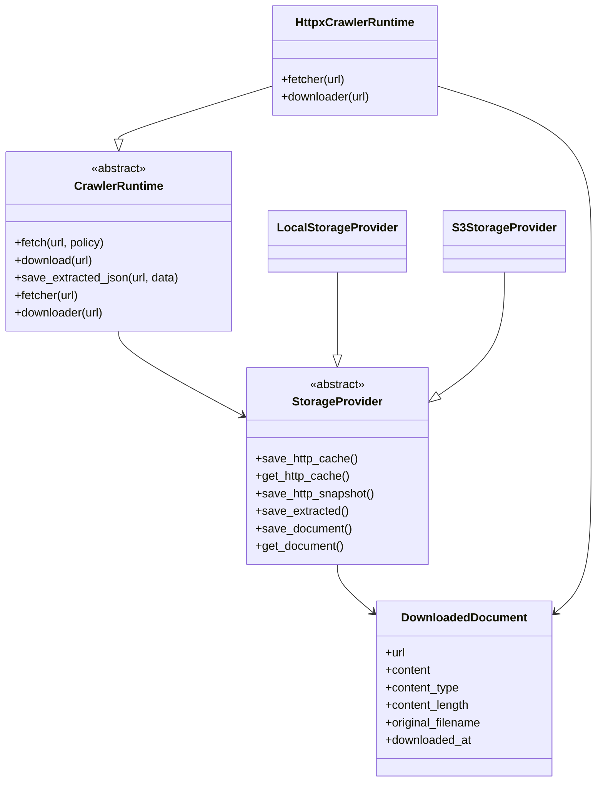

# Runtime Design

This document describes the current runtime implementation and class relationships.

Unlike architectural documents, this design may evolve as new runtime requirements emerge.

## Purpose

The crawler runtime is responsible for:

- applying cache policies
- orchestrating network access
- persisting artifacts
- downloading documents
- delegating storage concerns to a storage backend

The runtime intentionally remains independent from:

- filesystem layout
- S3 implementation
- details plugin business logic

Storage concerns are delegated to a `StorageProvider`.

## Main Componenents



## Responsibilities

### CrawlerRuntime

Responsible for:

- cache policy application
- cache statistics
- change detection
- document download orchestration
- extracted data persistence

Not responsible for:

- path construction
- S3 key generation
- filesystem management

### HttpxCrawlerRuntime

Responsible for:

- HTTP requests
- redirects
- response validation
- document downloading

Not responsible for:

- storage
- cache persistence

### StorageProvider

Responsible for:

- URL canonicalization
- Resource ID generation
- artifact persistence
- artifact retrieval

Not responsible for:

- HTTP requests
- cache decisions
- parsing

### DownloadedDocument

Represents a downloaded document independently of the storage backend. A downloaded document
contains:

- content
- metadata
- source URL

The storage backend is responsible for persisting this information.

## Design Rationale

The runtime uses dependency injection:

```text
CrawlerRuntime
    ↓
StorageProvider
```

allowing storage implementations to be replaced without affecting crawler logic.

Examples:

```text
LocalStorageProvider
S3StorageProvider
```

The runtime interacts only with URLs. Concepts such as:

- Resource IDs
- filesystem paths
- S3 object keys

remain internal implementation details of the storage provider.
