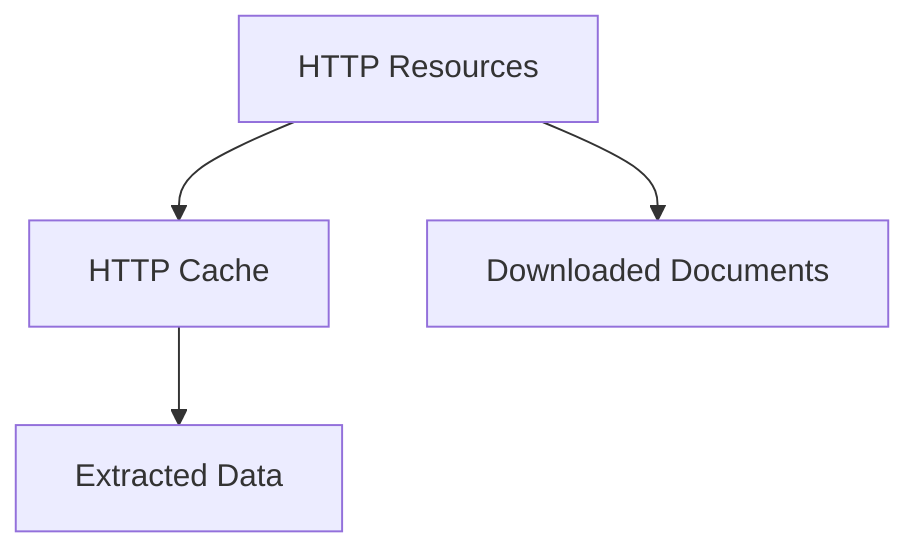

# Storage strategy

## Purpose

The crawler persists several categories of artifacts.

Each category serves a different purpose and may have different retention policies in the future.

The storage model must remain independent from the physical storage backend.

Supported storage backends include:

- Local filesystem
- Amazon S3

Future backends may be added without impacting plugin logic.

## Storage Backend Responsibilities

A storage backend is responsible for:

- persisting artifacts
- retrieving artifacts
- persisting metadata
- mapping Resource IDs to physical resources

Storage backends must remain transparent to plugins.

## Logical Storage Areas

The storage model is organized around logical storage areas.

These logical areas are independent from the physical storage implementation (local filesystem, S3,
or future backends).

The system currently manages three logical storage areas:

- HTTP Cache
- Extracted Data
- Downloaded Documents

Logical storage areas describe the role of stored artifacts.

The same logical area may be implemented differently depending on the storage backend.



## URL-Based Identity

All storage areas rely on the same deterministic URL identity mechanism.

```text
URL
 ↓
Canonicalization
 ↓
SHA1
 ↓
Resource ID
```

The same URL must always generate the same Resource ID.

### Canonicalization

Before hash generation:

- query parameters are parsed
- parameters are sorted
- the URL is rebuilt in canonical form

This guarantees that semantically equivalent URLs generate the same Resource ID.

### Hash Algorithm

The hashing algorithm used in v1 is **SHA‑1**, applied to the UTF‑8 encoded URL.

The goal is deterministic mapping, not cryptographic security.

### Stability

Resource ID generation must remain stable across runs to preserve cache usability and storage
consistency

## HTTP Cache

### Purpose

The HTTP cache avoids re-fetching already downloaded HTTP resources during crawling. It enables:

- offline replay
- safe long-runnning execution
- deterministic behvior across runs

The cache is **not** a performance optimization layer and **not** a data storage system.

Examples:

- event pages
- race pages
- result detail pages

### Characteristics

- deterministic URL → resource mapping
- replayable
- cache policies supported
- snapshots supported

### Authoritative

No.

The source remains the target website. Cached resources may be refreshed or invalidated.

### Scope

The HTTP cache applies only to **raw HTTP responses**.

Typical resources include:

- HTML pages
- text resources

The cache stores raw HTTP responses and remains agnostic of resource semantics.

When using `REFRESH_AND_CACHE`, a plugin-provided normalization step may be applied before comparing
fetched and cached content.

This normalization is:

- transient
- used only for change detection
- never persisted

### Cache Policies

Cache behavior is explicitly defined at call time.

Supported policies:

- **NO_CACHE**
  - Always fetch from the network.
  - No cache read or write.
  - Used when fresh data is required and caching is undesirable.

- **CACHE_IF_PRESENT**
  - Use cached content if available.
  - Otherwise fetch and store the response.
  - Used for stable pages (results, detail pages).

- **REFRESH_AND_CACHE**
  - Always fetch from the network.
  - Then **only when the fetched content differs from the** **currently cached version**:
    - Overwrite the active cache entry.
    - Keep a timestamped snapshot of the previous version (if exist) for debugging
  - Used for pages that must be refreshed regularly but still need replayability (e.g. event listing
    pages).

Cache decisions are **never implicit**.

### API

```python
fetch_page(url: str, cache_policy: CachePolicy) -> str
```

### Snapshots

Snapshots are created only when:

- using `REFRESH_AND_CACHE`
- content is detected as changed

Snapshots are:

- write-only
- never automatically replayed
- intended for debugging and inspection

### Behavioral Rules

- Snapshot creation may use normalized content comparison.
- Raw content is always persisted without modification.
- The cache remains independent from parsing and normalization concerns.

### Non-Goals

Version 1 intentionally excludes:

- HTTP cache headers (ETag, Cache-Control, etc.)
- Time-based expiration (TTL)
- Partial invalidation
- Concurrency or distributed cache

## Extracted Data

### Purpose

Store raw extraction outputs.

Examples:

```json
{
  "races": [...],
  "documents": [...]
}
```

### Characteristics

- optional
- useful for debugging
- useful for functional test generation
- generated from cached HTTP resources

### Authoritative

No.

Extracted data can always be rebuilt from the HTTP cache.

## Downloaded Documents

### Purpose

Store downloadable artifacts discovered during crawling.

Examples:

- PDF rankings
- XLSX exports
- CSV exports

### Characteristics

- immutable once downloaded
- downloaded on demand
- identified by document URL

### Authoritative

Potentially.

Documents may have long-term value because they can disappear, be modified, or become inaccessible
on the source website.

### Metadata

Each downloaded document is associated with metadata.

The physical representation of the metadata is backend-specific.

The metadata includes:

- ressource_id
- url
- original_filename
- content_type
- content_length
- downloaded_at

## Local Filesystem Mapping

Current implementation.

```text
.cache/
└── <plugin_name>/
    ├── http/
    │   ├── current/
    │   └── snapshots/
    │
    └── extracted/

.documents/
└── <plugin_name>/
```

### HTTP Cache

```text
http/
└── current/
    └── 1c/
        └── 1c4230....html
```

### Snapshots

```text
http/
└── snapshots/
    └── 1c/
        └── 1c4230.../
            └── 2026-06-08T10-12-03.html
```

### Extracted

```text
extracted/
└── 1c/
    └── 1c4230....json
```

### Documents

The local filesystem implementation stores document metadata in a metadata.json file located
alongside the downloaded document in a directory using the Resource ID as name.

```text
.documents/
  plugin_name/
    1c/
      1c4230b146f1e14eae42b75a7b64f117e561dea7/
        official_file_name.ext
        metadata.json

    25/
      252659e0ea47a78c24a82acf647450add45ac9b3/
        another_official_file_name.ext
        metadata.json
```

## S3 Mapping

The filesystem and S3 layouts do not necessarily mirror each other exactly.

Both implementations expose the same logical storage areas while optimizing organization for their
respective backend

Example:

```text
s3://ranking/

<plugin_name>/
├── cache/
│   ├── http/
│   └── extracted/
│
└── documents/
```

The S3 layout uses plugin-centric prefixes, while the local filesystem layout uses artifact-centric
root directories.

The S3 implementation may store document metadata using S3 object metadata and/or dedicated metadata
objects.

Examples:

```text
s3://ranking/breizhchrono/cache/http/current/1c/1c4230....html
s3://ranking/breizhchrono/cache/extracted/1c/1c4230....json
s3://ranking/breizhchrono/documents/1c/1c4230.../official_file_name.pdf
```

### Bucket Strategy

Version 1 uses a single bucket.

Example:

s3://ranking/

Logical separation is achieved through prefixes rather than multiple buckets.

## Retention Policy

Current rule: **Keep Everything**

Rationale:

- project is still exploring real-world data
- storage requirements are not yet known future retention strategies
- may differ per storage area

Retention policies will be defined later.

## Design Principles

- storage is independent from plugins
- storage is independent from parsing
- storage is independent from normalization
- storage backend must be replaceable
- URL identity must remain stable
- local filesystem and S3 share the same logical structure
