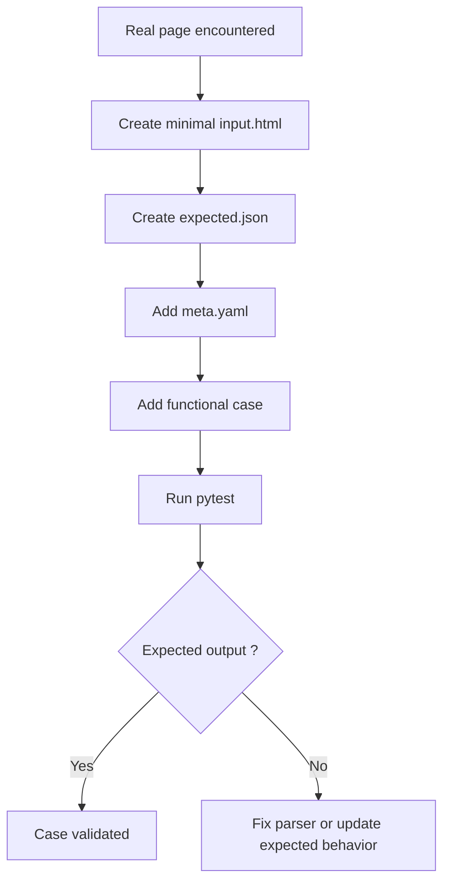

# Test Strategy

This directory contains all tests used to validate the scraping and extraction layer.

The objective is to maintain a clear separation between:

- **Unit tests**: validate isolated functions and internal logic.
- **Functional cases**: validate extractors against real-world HTML structures encountered on target
  websites.

## Unit Tests

### Unit tests Goal

Validate implementation details and business logic independently from real HTML pages.

Examples:

- URL construction
- Date normalization
- Ranking calculations
- Edge cases
- Error handling

Unit tests should:

- be small and focused
- execute quickly
- not depend on external resources
- be easy to understand

## Functional tests

### Functional tests goal

Validate that an extractor correctly handles HTML structures encountered in real websites. Each case
represents:

a real page encountered during scraping, or a realistic variation that has already caused a bug or
required a parser evolution.

Functional cases define the **supported parsing behavior** of the scraper.

The objective is not only to validate expected behavior, but also to preserve knowledge about
real-world HTML variations discovered during scraper development

### Principles

#### Real-world first

Cases should be based on pages that actually existed.

#### Minimal HTML

HTML should be reduced to the smallest structure required to reproduce the parsing behavior.

Remove:

- headers
- footers
- scripts
- styles
- unrelated content

Keep:

- relevant tags
- relevant classes
- relevant attributes
- relevant DOM hierarchy

#### Stable

Cases must be executable offline.

Tests must never depend on a live website.

#### Privacy

Personal information should be anonymized when necessary:

- names
- emails
- identifiers

Do not store unnecessary personal data.

### Directory structure

```text
test/
└── plugins/
    └── `plugin_name`/
        ├── unit/
        │   └── test_*.py
        │
        └── cases/
            └── data/
                └── `section_name`/
                    └── case-xxx-yyyyyy/
                        ├── expected.json
                        ├── input.html
                        ├── meta.yaml
                        └── screenshot.png

```

### Case files

#### input.html

HTML fragment used as extractor input.

The file should contain only the minimum structure required to reproduce the behavior being tested

#### expected.json

Expected extractor output.

Exemple:

```json
{
  "event_race_raw": "Brest Running Tour 2026 - 10km",
  "races": [
    {
      "name": "10km"
    }
  ]
}
```

#### meta.yaml

Human-readable information about the case.

Example:

```yaml
id: case-001-multiple-races

name: Multiple races on event page

description: >
  Standard YoChrono event page containing multiple race links.

source_site: yochrono

tags:
  - eventdetail
  - happy-path

notes: >
  HTML simplified from a production page. Header, footer and scripts removed.
```

##### Fields

###### id

Unique identifier of the case.

###### name

Short human-readable title.

###### description

Description of the scenario being tested.

###### source_site

Origin website.

###### tags

Optional categorization.

Examples:

- happy-path
- edge-case
- regression
- eventdetail
- ranking
- known-website-issue (used for site bug, data quality bug, not parser bug)

###### notes

Additional context.

#### screenshot.png

Optional screenshot used to document visually the original page structure.

### When Should A New Case Be Added?

A new case should be added when:

- a new HTML structure is encountered
- a parser bug need to be fixed
- a new extraction rule is introduced
- a regression must be prevented

A new case should not be added for purely technical implementation details.

These belong in unit tests.

### Workflow



#### Creating a new case

1. Capture the HTML. Adapt it.
2. Run the extract CLI: `ranking extract` to generate expected.json.
3. Eventually adapt the expected.json if you want to fix a parser bug.
4. Create meta.yaml.
5. Execute pytest.

## Test Philosophy

Unit tests answer:

> Does the code behave correctly?

Functional cases answer:

> Does the extractor support this HTML structure?

Both are required.

Unit tests protect the implementation.

Functional cases protect the product behavior.
